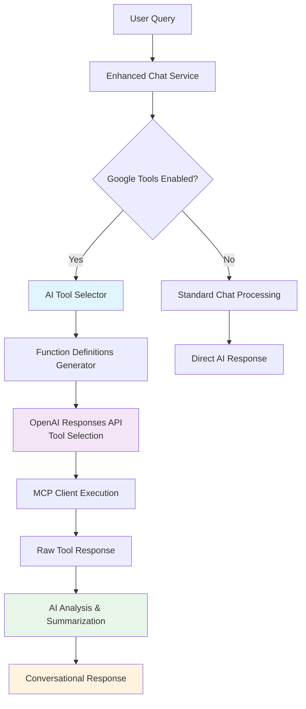

# TURFMAPP AI Agent - Intelligent Agentic Chat System

A sophisticated, enterprise-grade AI agent system featuring **intelligent tool selection**, **Google services integration**, and **agentic workflows** with multi-model AI capabilities. Built with FastAPI backend and accessible frontend, designed for production environments.

## 🤖 Agentic Design Flow

### **AI-Driven Tool Selection Architecture**


### **Intelligent Tool Selection Process**

1. **Context Analysis**: AI examines user query to determine intent
   - "What's my latest email about?" → **gmail_recent** (max_results: 1)
   - "Find emails from John" → **gmail_search** (query: "John")
   - "Show my calendar today" → **calendar_upcoming_events**

2. **Dynamic Function Definitions**: Rich descriptions guide AI selection
   ```python
   gmail_recent: "Get recent Gmail messages in chronological order. 
                  Use for 'latest', 'recent', 'first', 'newest' queries."
   
   gmail_search: "Search Gmail with specific queries. Use for finding 
                  emails about topics, from people, containing keywords."
   ```

3. **Smart Parameter Selection**: AI determines optimal parameters
   - 1 result for "first/latest" queries
   - 3-5 results for "recent emails" 
   - 10+ results for broader searches

4. **AI-Powered Analysis**: Raw tool responses processed into conversational summaries

## 🏛️ System Design Architecture

### **Multi-Layer Service Architecture**
```
┌─────────────────────────────────────────────────────────────┐
│                    Frontend Layer                           │
│  ┌─────────────────┐  ┌─────────────────┐  ┌─────────────── │
│  │   Chat UI       │  │  Settings UI    │  │   Admin UI     │
│  │  - Real-time    │  │  - Preferences  │  │  - User Mgmt   │
│  │  - Sources      │  │  - Permissions  │  │  - Analytics   │
│  │  - History      │  │  - Google Auth  │  │  - Monitoring  │
│  └─────────────────┘  └─────────────────┘  └─────────────── │
└─────────────────────────────────────────────────────────────┘
           │                    │                    │
           ▼                    ▼                    ▼
┌─────────────────────────────────────────────────────────────┐
│                      API Layer                             │
│  ┌─────────────────┐  ┌─────────────────┐  ┌─────────────── │
│  │   Chat API      │  │  Settings API   │  │   Admin API    │
│  │  /chat/send     │  │  /settings/*    │  │  /admin/*      │
│  │  /conversations │  │  - Profile      │  │  - Users       │
│  │  /models        │  │  - Preferences  │  │  - Stats       │
│  └─────────────────┘  └─────────────────┘  └─────────────── │
└─────────────────────────────────────────────────────────────┘
           │                    │                    │
           ▼                    ▼                    ▼
┌─────────────────────────────────────────────────────────────┐
│                   Service Layer                            │
│  ┌─────────────────────────────────────────────────────────┐ │
│  │            Enhanced Chat Service (Core)                  │ │
│  │  ┌─────────────────┐  ┌─────────────────┐  ┌──────────  │ │
│  │  │ AI Tool Selector│  │  Google MCP     │  │ Response   │ │
│  │  │ - Function Defs │  │  - Gmail Tools  │  │ Analyzer   │ │
│  │  │ - Smart Params  │  │  - Calendar     │  │ - AI Summary│ │
│  │  │ - Context Aware │  │  - Drive Tools  │  │ - Extraction│ │
│  │  └─────────────────┘  └─────────────────┘  └──────────  │ │
│  └─────────────────────────────────────────────────────────┘ │
│  ┌─────────────────┐  ┌─────────────────┐  ┌─────────────── │
│  │   Auth Service  │  │  User Service   │  │  Tool Manager  │
│  │  - JWT Tokens   │  │  - Preferences  │  │  - Web Search  │
│  │  - Role Control │  │  - Permissions  │  │  - Traditional │
│  │  - Admin Cache  │  │  - Profile Mgmt │  │  - Integration │
│  └─────────────────┘  └─────────────────┘  └─────────────── │
└─────────────────────────────────────────────────────────────┘
           │                    │                    │
           ▼                    ▼                    ▼
┌─────────────────────────────────────────────────────────────┐
│                 Integration Layer                          │
│  ┌─────────────────┐  ┌─────────────────┐  ┌─────────────── │
│  │ OpenAI API      │  │  Google APIs    │  │  Supabase      │
│  │ - GPT-4O        │  │  - Gmail API    │  │  - PostgreSQL  │
│  │ - O1 Models     │  │  - Calendar API │  │  - Auth        │
│  │ - Responses API │  │  - Drive API    │  │  - Users       │
│  │ - Function Call │  │  - OAuth 2.0    │  │  - Sessions    │
│  └─────────────────┘  └─────────────────┘  └─────────────── │
└─────────────────────────────────────────────────────────────┘
```

### **Agentic Workflow Pattern**
```
User Query → Context Analysis → Tool Selection → Execution → AI Analysis → Response
     ↓              ↓               ↓              ↓            ↓            ↓
   Intent       Smart Routing   Dynamic Params   MCP Client   Summarization  Conversation
   Detection    Based on Query  AI-Generated     Real APIs    Natural Lang   Enhanced UX
```

## 🏗️ Project Structure

```
├── backend/                    # FastAPI Python Backend
│   ├── app/
│   │   ├── api/v1/            # API endpoints
│   │   │   ├── admin.py       # Admin management endpoints
│   │   │   ├── auth.py        # Authentication endpoints
│   │   │   ├── chat.py        # Chat API endpoints
│   │   │   ├── preferences.py  # User preferences
│   │   │   └── settings.py    # User settings endpoints
│   │   ├── core/              # Core functionality
│   │   │   ├── auth.py        # Supabase authentication
│   │   │   ├── config.py      # App configuration
│   │   │   └── simple_auth.py # Legacy authentication
│   │   ├── services/          # Business logic layer
│   │   │   ├── enhanced_chat_service.py # Core agentic chat service
│   │   │   ├── mcp_client_simple.py    # Google MCP integration
│   │   │   ├── tool_manager.py         # Traditional tools
│   │   │   ├── master_agent.py         # Agent orchestration
│   │   │   └── conversation_context_agent.py # Context analysis
│   │   ├── database/          # Database models & services
│   │   └── utils/             # Utility functions
│   ├── tests/                 # Comprehensive test suite
│   │   ├── test_admin_api.py  # Admin API tests
│   │   ├── test_settings_api.py # Settings API tests
│   │   ├── test_api_ping/     # API ping tests
│   │   └── test_integration/  # Integration tests
│   ├── API_DOCUMENTATION.md   # API endpoint documentation
│   └── requirements.txt       # Python dependencies
├── frontend/                  # Static Frontend
│   ├── public/
│   │   ├── home.html          # Main chat interface
│   │   ├── settings.html      # Settings & admin interface
│   │   ├── scripts/
│   │   │   ├── chat.js        # Chat functionality
│   │   │   └── google-auth.js # Authentication & permissions
│   │   └── styles/            # CSS modules
│   ├── tests/
│   │   └── permission-system.test.js # Frontend permission tests
│   ├── USER_GUIDE.md          # User guide for permission system
│   └── Dockerfile             # Frontend container
├── docker-compose.yml         # Multi-container orchestration
└── README.md                  # This file
```

## 🎯 Architecture Overview

### **Backend Architecture (FastAPI)**

#### **API Layer** (`app/api/v1/`)
- **RESTful endpoints** following OpenAPI standards
- **Authentication middleware** with JWT token validation
- **Request/Response validation** using Pydantic models
- **Error handling** with consistent HTTP status codes

#### **Service Layer** (`app/services/`)
- **Business logic separation** from API endpoints
- **Enhanced Chat Service** supporting multiple AI models
- **Database fallback patterns** for resilience
- **Sources extraction** from AI responses with metadata

#### **Database Integration**
- **Supabase/PostgreSQL** for persistent storage
- **Conversation management** with message history
- **User preferences** and session management
- **Fallback in-memory storage** for development/testing

### **Frontend Architecture**

#### **Modern Chat Interface**
- **Real-time messaging** with typing indicators
- **Sources display** with favicon integration
- **Table parsing** for structured data display
- **Conversation history** with persistent storage

#### **Responsive Design**
- **Mobile-first approach** with touch interactions
- **Accessibility compliance** (WCAG 2.1 AA)
- **Keyboard navigation** support
- **High contrast mode** compatibility

## 🤖 AI Models Supported

### **OpenAI Responses API Integration**
- **GPT-4O**: Most capable model for complex reasoning
- **GPT-4O Mini**: Fast and efficient for general queries
- **O1**: Advanced reasoning capabilities
- **O1 Mini**: Reasoning optimized for specific tasks
- **O1 Preview**: Latest reasoning model
- **GPT-5-mini**: With web search and enhanced reasoning (4000+ tokens)

### **Advanced Features**
- ✅ **Sources extraction** from URLs in responses
- ✅ **Reasoning display** for O1 models
- ✅ **Web search integration** for current information
- ✅ **Tool calling** support for enhanced capabilities
- ✅ **Conversation context** with message history
- ✅ **Auto-titles** from first user message

## 🌟 Google Services Integration (MCP)

### **Intelligent Personal Assistant Capabilities**
The system features a sophisticated **Model Context Protocol (MCP)** implementation that provides seamless access to Google services with AI-driven tool selection:

#### **📧 Gmail Integration**
- **Smart Query Processing**: "What's my latest email about?" → Retrieves 1 most recent email with AI summary
- **Intelligent Search**: "Find emails from John about project" → Targeted Gmail search with conversational results
- **Context-Aware Selection**: AI automatically chooses between `gmail_recent` vs `gmail_search` based on intent
- **Natural Language Responses**: Raw email data processed into conversational summaries

#### **📅 Calendar Integration**
- **Upcoming Events**: "What's on my calendar today?" → Formatted calendar view
- **Meeting Summaries**: AI-generated overviews of calendar events
- **Time-Sensitive Queries**: Automatic date/time context processing

#### **🗂️ Google Drive Integration**
- **File Management**: "Show me my recent documents" → Organized file listings
- **Smart Search**: Content-aware file discovery and organization

### **MCP Architecture Benefits**
- **Zero Hardcoding**: Eliminates keyword-based tool selection
- **AI-First Approach**: Tools selected based on semantic understanding, not pattern matching
- **Rich Function Descriptions**: Detailed tool metadata guides AI decision-making  
- **Dynamic Parameter Generation**: AI determines optimal parameters (e.g., result limits, search queries)
- **Response Enhancement**: Raw API data transformed into conversational, user-friendly responses

## 🚀 Key Features

### **Agentic Chat System**
- ✅ **Intelligent Tool Selection** - AI-driven decision making for tool usage
- ✅ **Google Services Integration** - Gmail, Calendar, Drive with MCP protocol
- ✅ **Multi-model support** - Switch between AI models seamlessly
- ✅ **Conversation management** - Persistent chat history
- ✅ **AI-Powered Analysis** - Raw data transformed into conversational responses
- ✅ **Context-Aware Processing** - Intent detection and smart parameter selection
- ✅ **Sources integration** - Automatic URL extraction and favicon display
- ✅ **Table rendering** - Automatic parsing of tabular data
- ✅ **Real-time responses** - Streaming and async response handling
- ✅ **Error recovery** - Graceful fallbacks and error handling

### **Authentication & Security**
- ✅ **JWT-based authentication** with Supabase integration
- ✅ **Role-based access control** (user, admin, super_admin)
- ✅ **Permission management system** with admin caching
- ✅ **Secure token handling** with automatic refresh
- ✅ **Input validation** and sanitization
- ✅ **CORS configuration** for cross-origin requests
- ✅ **Rate limiting** ready for production

### **Developer Experience**
- ✅ **Comprehensive testing** - Unit, integration, and ping tests
- ✅ **Docker containerization** - Multi-stage builds
- ✅ **Hot reload development** - Fast iteration cycle
- ✅ **Detailed logging** - Debug and monitoring capabilities
- ✅ **API documentation** - Auto-generated OpenAPI specs

## 🛠️ Recent Improvements (September 2025)

### **Agentic AI System Implementation (NEW)**
1. **AI-Driven Tool Selection**: Replaced hardcoded keyword matching with intelligent AI-based tool selection
2. **Google MCP Integration**: Complete Model Context Protocol implementation for Gmail, Calendar, and Drive
3. **Smart Parameter Generation**: AI automatically determines optimal parameters (result limits, search queries)
4. **Response Analysis Pipeline**: Raw API data transformed into natural, conversational responses
5. **Context-Aware Processing**: Intent detection eliminates inappropriate tool usage for general queries

### **Enhanced Chat Intelligence (NEW)**
1. **Function Calling Architecture**: Rich tool descriptions guide AI decision-making process
2. **Dynamic Query Processing**: "What's my latest email?" → `gmail_recent(max_results=1)` + AI summary
3. **Multi-Step AI Pipeline**: Tool selection → Execution → Analysis → Conversational response
4. **Error Recovery**: Graceful fallbacks when tools fail or return empty results
5. **Debugging Integration**: Comprehensive logging for tool selection and execution monitoring

### **Permission Management System**
1. **Role-based Access Control**: Complete RBAC implementation with user, admin, and super_admin roles
2. **Settings Page Redesign**: Transformed admin page into tabbed settings interface
3. **Admin Caching**: 5-minute cache for admin status verification improving UI responsiveness
4. **User Management**: Full admin interface for user role assignment and account management
5. **Supabase Integration**: Migration from SQLAlchemy to pure Supabase authentication

### **Major Technical Fixes**
1. **API Response Format**: Fixed nested response structure parsing for OpenAI Responses API
2. **Tool Name Corrections**: Resolved calendar tool naming inconsistencies
3. **Sources Loading Fixed**: Conversation history now properly preserves message metadata including sources
4. **UUID Import Error Resolved**: Fixed missing import causing conversation loading failures  
5. **GPT-5-mini Support**: Enhanced parsing for complex output format with increased token limits

### **Enhanced Testing**
- **Frontend permission tests** for admin UI functionality and caching
- **Backend API tests** for admin and settings endpoints with role validation
- **Integration tests** that verify actual functionality vs just endpoint accessibility
- **Test coverage** expanded to catch real business logic issues
- **Response format validation** to ensure frontend-backend compatibility

### **Performance Optimizations**
- **Admin status caching** - 5-minute cache with automatic invalidation on token changes
- **Token limit optimization** - GPT-5-mini gets 4000 tokens, others get 1500
- **Incomplete response handling** - Graceful degradation for truncated responses
- **Database fallback patterns** - Resilient operation even with database issues

## 🔧 Configuration

### **Environment Variables**
```bash
# Database Configuration
SUPABASE_URL=your_supabase_url
SUPABASE_SERVICE_ROLE_KEY=your_service_role_key
DATABASE_URL=your_postgres_url

# OpenAI Configuration
OPENAI_API_KEY=your_openai_api_key

# App Configuration
ALLOWED_ORIGINS=http://localhost:3005,https://yourdomain.com
JWT_SECRET_KEY=your_jwt_secret
```

### **Model Configuration**
```python
# Available models with automatic API routing
SUPPORTED_MODELS = [
    {"id": "gpt-4o", "name": "GPT-4O", "api": "responses"},
    {"id": "gpt-4o-mini", "name": "GPT-4O Mini", "api": "responses"},
    {"id": "o1", "name": "O1", "api": "responses"},
    {"id": "o1-mini", "name": "O1 Mini", "api": "responses"},
    {"id": "o1-preview", "name": "O1 Preview", "api": "responses"},
    {"id": "gpt-5-mini", "name": "GPT-5-mini", "api": "responses", "tokens": 4000}
]
```

## 🚀 Quick Start

### **Development Setup**
```bash
# Clone repository
git clone <repository-url>
cd turfmapp-ai-agent

# Backend setup
cd backend
python -m venv venv
source venv/bin/activate  # On Windows: venv\Scripts\activate
pip install -r requirements.txt

# Environment configuration
cp .env.example .env
# Edit .env with your API keys and database URLs

# Run backend
uvicorn app.main:app --reload --port 8000

# Frontend (separate terminal)
cd ../frontend/public
python -m http.server 3005
```

### **Docker Deployment**
```bash
# Build and run with Docker Compose
docker-compose up --build

# Access application
open http://localhost:3005
```

## 🧪 Testing

### **Test Categories**
```bash
# Run all tests
pytest

# API ping tests (endpoint accessibility)
pytest tests/test_api_ping/

# Integration tests (actual functionality)
pytest tests/test_integration/

# Specific test files
pytest tests/test_api_ping/test_chat_ping.py -v
pytest tests/test_integration/test_simple_integration.py -v
```

### **Test Coverage**
- **18/18 ping tests passing** - Endpoint accessibility verified
- **4/4 integration tests passing** - Business logic functionality verified
- **Admin API tests** - Role-based access control and user management
- **Settings API tests** - Profile and preferences management
- **Frontend permission tests** - UI visibility and caching functionality
- **200+ total tests** across authentication, chat, admin, and core functionality
- **Response format validation** ensures frontend-backend compatibility

## 📝 API Documentation

### **Chat Endpoints**
```
POST   /api/v1/chat/send              # Send chat message
GET    /api/v1/chat/conversations     # List conversations
GET    /api/v1/chat/conversations/{id} # Get conversation details
DELETE /api/v1/chat/conversations/{id} # Delete conversation
GET    /api/v1/chat/health            # Health check
GET    /api/v1/chat/models            # Available models
```

### **Settings Endpoints**
```
GET    /api/v1/settings/profile       # Get user profile
PUT    /api/v1/settings/profile       # Update user profile
GET    /api/v1/settings/preferences   # Get user preferences
PUT    /api/v1/settings/preferences   # Update user preferences
DELETE /api/v1/settings/account       # Delete user account
```

### **Admin Endpoints** (Requires admin/super_admin role)
```
GET    /api/v1/admin/stats            # System statistics
GET    /api/v1/admin/users            # List all users
GET    /api/v1/admin/users/pending    # List pending users
PUT    /api/v1/admin/users/{id}       # Update user role/status
POST   /api/v1/admin/users/{id}/approve # Approve pending user
DELETE /api/v1/admin/users/{id}       # Delete user account
GET    /api/v1/admin/announcements    # List announcements
POST   /api/v1/admin/announcements    # Create announcement
PUT    /api/v1/admin/announcements/{id} # Update announcement
DELETE /api/v1/admin/announcements/{id} # Delete announcement
GET    /api/v1/admin/announcements/active # Get active announcements (public)
```

### **Response Formats**
```json
// Chat send response
{
  "conversation_id": "uuid",
  "user_message": {"role": "user", "content": "..."},
  "assistant_message": {"role": "assistant", "content": "..."},
  "sources": [{"url": "...", "site": "...", "favicon": "..."}],
  "reasoning": "..." // For O1 models
}

// Conversation history response
{
  "conversation": {"id": "uuid", "title": "Auto-generated title"},
  "messages": [
    {
      "id": "uuid",
      "role": "user|assistant",
      "content": "...",
      "created_at": "ISO datetime",
      "metadata": {"sources": [...], "model": "..."}
    }
  ]
}
```

## 🔒 Security Features

### **Authentication & Authorization**
- ✅ **JWT tokens** with Supabase integration
- ✅ **Role-based access control** (user, admin, super_admin)
- ✅ **Admin status caching** with 5-minute TTL for performance
- ✅ **Automatic token refresh** handling
- ✅ **Secure session management** with proper cleanup
- ✅ **User context preservation** across requests

### **Input Validation**
- ✅ **Pydantic models** for request/response validation
- ✅ **SQL injection prevention** with parameterized queries
- ✅ **XSS protection** with content sanitization
- ✅ **CORS configuration** for cross-origin security

## 📊 Performance Metrics

### **Response Times**
- **Health endpoints**: < 1 second
- **Chat responses**: 2-30 seconds (depending on model complexity)
- **Conversation loading**: < 2 seconds
- **Sources extraction**: Real-time with caching

### **Scalability**
- **Database connection pooling** for concurrent requests
- **Async request handling** for better throughput
- **Fallback patterns** for resilience
- **Docker containerization** for horizontal scaling

## 🔮 Roadmap

### **Completed (September 2025)**
- [x] **Agentic AI System**: Intelligent tool selection with AI-driven decision making
- [x] **Google MCP Integration**: Gmail, Calendar, Drive with semantic understanding
- [x] **Permission management system** with role-based access control
- [x] **Admin caching** for improved performance
- [x] **AI Response Analysis**: Raw data transformation into conversational responses
- [x] **Function Calling Architecture**: Rich descriptions for AI tool selection
- [x] **Admin dashboard** with user management and system analytics

### **Next Phase (Q4 2025)**
- [ ] **Enhanced MCP Tools**: Deeper Google Workspace integration (Docs, Sheets, Slides)
- [ ] **Learning & Adaptation**: Agent performance tracking and optimization
- [ ] **Context Memory**: Long-term conversation context across sessions
- [ ] **Rate limiting** implementation for production scaling
- [ ] **Monitoring & alerting** integration with performance metrics

### **Feature Enhancements (2026)**
- [ ] **Multi-Agent Collaboration**: Specialized agents for different domains
- [ ] **File upload support** for documents and images with AI analysis
- [ ] **Voice message integration** with transcription and AI processing
- [ ] **Conversation sharing** and collaboration features
- [ ] **Advanced search** across conversation history with semantic search
- [ ] **Custom model fine-tuning** integration for domain-specific tasks

### **Enterprise Features (2026)**
- [ ] **Multi-tenant support** with isolated user environments
- [ ] **Agent Analytics Dashboard**: Tool usage patterns and effectiveness metrics
- [ ] **Audit logging** for compliance and security tracking
- [ ] **Backup and disaster recovery** procedures
- [ ] **API Rate Limiting & Quotas**: Enterprise-grade usage management

---

**Enterprise-Grade Agentic AI System**: This application represents a sophisticated intelligent agent implementation featuring AI-driven tool selection, Google services integration via MCP, and advanced conversational AI capabilities. Built with enterprise standards including comprehensive testing, security best practices, and scalable architecture optimized for production environments.

**Key Innovation**: Eliminates hardcoded tool selection with AI-powered semantic understanding, transforming raw API responses into natural conversational experiences.

**Last Updated**: September 8, 2025 - Agentic AI system implemented with intelligent tool selection, Google MCP integration, AI response analysis pipeline, and comprehensive testing framework.