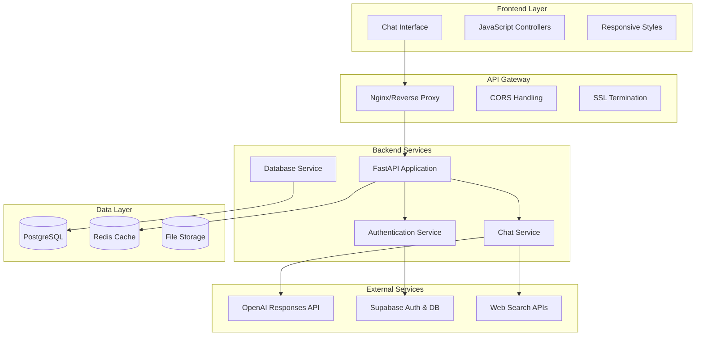
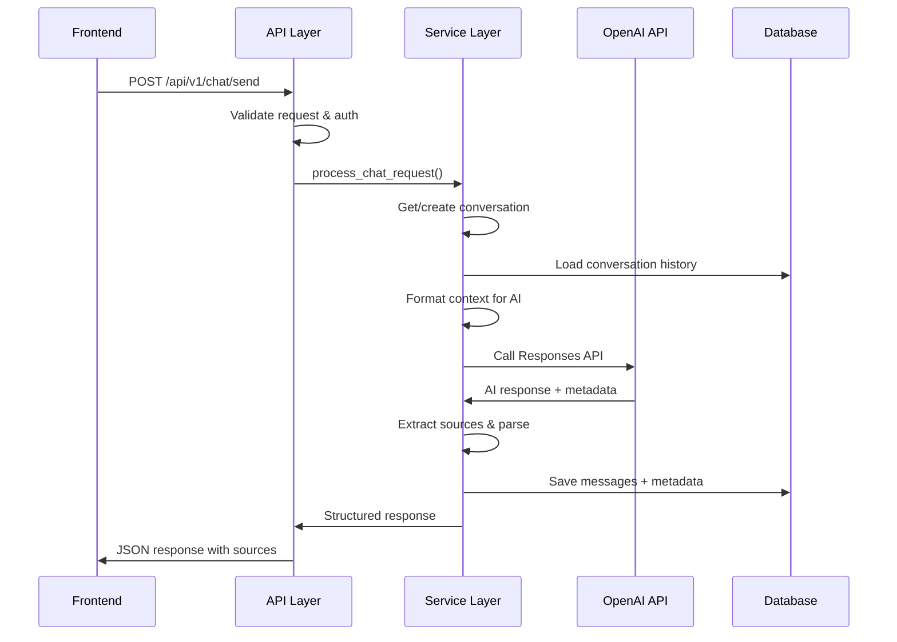
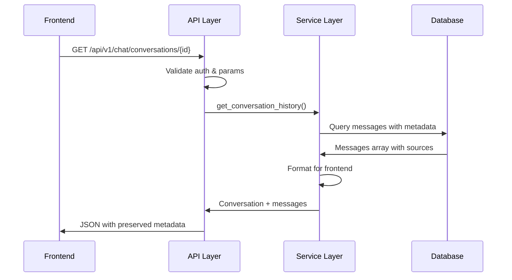
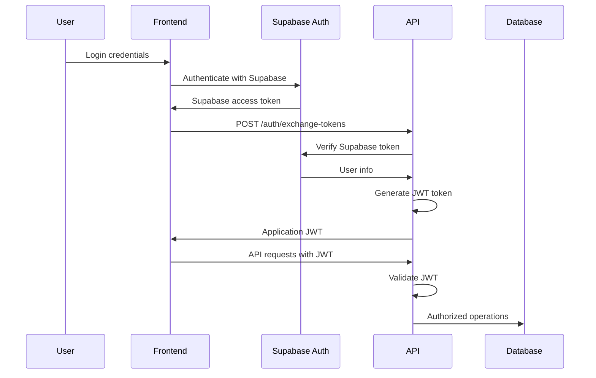

# System Architecture Documentation

## Overview

TURFMAPP AI Agent is a full-stack application built with modern, scalable architecture principles. The system follows a service-oriented design with clear separation of concerns, comprehensive error handling, and production-ready patterns.

## High-Level Architecture



## Backend Architecture (FastAPI)

### Layer Structure

#### 1. API Layer (`app/api/v1/`)
**Purpose**: HTTP request/response handling and validation

**Components**:
- `auth.py`: Authentication endpoints
- `chat.py`: Chat functionality endpoints  
- `preferences.py`: User preference management

**Responsibilities**:
- Request validation using Pydantic models
- HTTP status code management
- Authentication token verification
- Response formatting
- Error handling and logging

**Key Design Patterns**:
```python
# Dependency injection for authentication
@router.post("/send")
async def send_chat_message(
    request: ChatRequest,
    current_user: dict = Depends(get_current_user_from_token)
):
    # Business logic delegated to service layer
    result = await chat_service.process_chat_request(...)
    return ChatResponse(**result)
```

#### 2. Service Layer (`app/services/`)
**Purpose**: Business logic and external service integration

**Components**:
- `enhanced_chat_service.py`: Core chat functionality
- `conversation_service.py`: Conversation management
- `user_service.py`: User data management

**Responsibilities**:
- AI model integration and response processing
- Database operations with fallback patterns
- Sources extraction and enrichment
- Conversation context management
- Error recovery and resilience patterns

**Key Features**:
```python
class EnhancedChatService:
    async def process_chat_request(self, user_id, message, **kwargs):
        # 1. Get or create conversation
        # 2. Load conversation history for context
        # 3. Call appropriate AI model API
        # 4. Parse and enrich response (sources, reasoning)
        # 5. Save to database with fallback
        # 6. Return structured response
```

#### 3. Database Layer (`app/database/`)
**Purpose**: Data persistence and retrieval

**Components**:
- `models.py`: SQLAlchemy ORM models
- `conversation_service.py`: Conversation CRUD operations
- `user_service.py`: User data operations

**Responsibilities**:
- Database connection management
- Query optimization
- Transaction handling
- Data validation and constraints
- Migration support

#### 4. Core Layer (`app/core/`)
**Purpose**: Cross-cutting concerns and configuration

**Components**:
- `config.py`: Application configuration
- `jwt_auth.py`: Development JWT authentication middleware
- `security.py`: Security utilities

**Responsibilities**:
- Environment variable management
- Authentication token validation
- Security policy enforcement
- Application lifecycle management

## Data Flow Architecture

### 1. Chat Message Flow


### 2. Conversation Loading Flow


## Database Architecture

### Schema Design
```sql
-- Core conversation storage
CREATE TABLE conversations (
    id UUID PRIMARY KEY DEFAULT gen_random_uuid(),
    user_id UUID NOT NULL,
    title VARCHAR(255) NOT NULL,
    created_at TIMESTAMP DEFAULT NOW(),
    updated_at TIMESTAMP DEFAULT NOW(),
    FOREIGN KEY (user_id) REFERENCES auth.users(id)
);

-- Message storage with metadata
CREATE TABLE messages (
    id UUID PRIMARY KEY DEFAULT gen_random_uuid(),
    conversation_id UUID NOT NULL,
    role VARCHAR(20) NOT NULL CHECK (role IN ('user', 'assistant', 'system')),
    content TEXT NOT NULL,
    metadata JSONB DEFAULT '{}',
    created_at TIMESTAMP DEFAULT NOW(),
    FOREIGN KEY (conversation_id) REFERENCES conversations(id) ON DELETE CASCADE
);

-- Indexes for performance
CREATE INDEX idx_conversations_user_id ON conversations(user_id);
CREATE INDEX idx_messages_conversation_id ON messages(conversation_id);
CREATE INDEX idx_messages_created_at ON messages(created_at);
CREATE INDEX idx_messages_metadata_sources ON messages USING GIN ((metadata->'sources'));
```

### Metadata Storage Strategy
Messages store rich metadata in JSONB format:

```json
{
  "sources": [
    {
      "url": "https://example.com",
      "site": "example.com", 
      "favicon": "https://...",
      "title": "Page Title",
      "thumbnail": "https://..."
    }
  ],
  "model": "gpt-4o",
  "api_response": {...},
  "reasoning": "...",
  "tools_used": [...]
}
```

## Service Integration Architecture

### OpenAI API Integration
```python
class EnhancedChatService:
    def __init__(self):
        self.responses_api_key = os.getenv("OPENAI_API_KEY")
        self.responses_base_url = "https://api.openai.com/v1/responses"
    
    async def call_responses_api(self, messages, model, **kwargs):
        # Model-specific configuration
        if model == "gpt-5-mini":
            payload["max_output_tokens"] = 4000  # Increased for web search
        else:
            payload["max_output_tokens"] = 1500
        
        # Handle async responses with polling
        # Parse model-specific response formats
        # Extract reasoning for O1 models
        # Handle incomplete responses gracefully
```

### Database Fallback Pattern
```python
async def use_database_fallback(self, func_name, *args, **kwargs):
    """Try database operation, fall back to in-memory storage if it fails."""
    try:
        # Attempt database operation
        method = getattr(ConversationService, func_name)
        return await method(*args, **kwargs)
    except Exception as e:
        print(f"Database {func_name} failed: {e}, using fallback")
        # Fall back to in-memory storage
        return self._handle_fallback_operation(func_name, *args, **kwargs)
```

## Security Architecture

### Authentication Flow


### Security Layers

#### 1. Authentication & Authorization
- **JWT tokens** with configurable expiration
- **Supabase integration** for user management
- **Role-based access control** (ready for implementation)
- **Token refresh** handling

#### 2. Input Validation
- **Pydantic models** for request validation
- **SQL injection prevention** with parameterized queries
- **XSS protection** with content sanitization
- **Rate limiting** (planned implementation)

#### 3. Data Protection
- **Environment variable** protection for secrets
- **Database encryption** at rest (Supabase)
- **TLS/SSL** for data in transit
- **Audit logging** (planned implementation)

## Error Handling Architecture

### Layered Error Handling
```python
# API Layer - HTTP error responses
@router.post("/send")
async def send_chat_message(...):
    try:
        result = await chat_service.process_chat_request(...)
        return ChatResponse(**result)
    except ValidationError as e:
        raise HTTPException(status_code=422, detail=str(e))
    except Exception as e:
        logger.error(f"Chat error: {e}")
        raise HTTPException(status_code=500, detail="Internal server error")

# Service Layer - Business logic errors
class EnhancedChatService:
    async def process_chat_request(...):
        try:
            # AI API call
            api_response = await self.call_responses_api(...)
        except Exception as e:
            # Return error message instead of failing
            return {
                "conversation_id": conversation_id,
                "assistant_message": {
                    "content": f"I apologize, but I encountered an error: {str(e)}"
                },
                "error": str(e)
            }
```

### Resilience Patterns

#### 1. Circuit Breaker (Future Implementation)
- **OpenAI API failures** trigger circuit breaker
- **Fallback responses** when circuit is open
- **Automatic recovery** when service is restored

#### 2. Retry Logic
- **Exponential backoff** for transient failures
- **Maximum retry limits** to prevent infinite loops
- **Jitter** to prevent thundering herd

#### 3. Graceful Degradation
- **Database fallback** to in-memory storage
- **Partial response handling** for incomplete AI responses
- **Source extraction** continues even if enrichment fails

## Performance Architecture

### Optimization Strategies

#### 1. Async Processing
```python
# Concurrent source enrichment
async def enrich_sources(sources):
    sem = asyncio.Semaphore(3)  # Limit concurrent requests
    async def enrich_single(source):
        async with sem:
            # Fetch page metadata with timeout
            return await fetch_metadata(source)
    
    await asyncio.gather(*(enrich_single(s) for s in sources))
```

#### 2. Caching Strategy (Planned)
- **Redis caching** for frequent queries
- **Response caching** for identical requests
- **Metadata caching** for source enrichment
- **User preference caching**

#### 3. Database Optimization
- **Connection pooling** for concurrent requests
- **Query optimization** with proper indexing
- **Batch operations** for bulk inserts
- **Pagination** for large result sets

## Monitoring & Observability

### Logging Architecture
```python
import logging

# Structured logging with context
logger = logging.getLogger(__name__)

@router.post("/send")
async def send_chat_message(request: ChatRequest, current_user: dict):
    logger.info("Chat request", extra={
        "user_id": current_user["id"],
        "model": request.model,
        "conversation_id": request.conversation_id,
        "message_length": len(request.message)
    })
```

### Metrics Collection (Planned)
- **Request/response times** per endpoint
- **Error rates** by service and error type
- **AI model usage** statistics
- **Database performance** metrics
- **User engagement** analytics

### Health Monitoring
```python
@router.get("/health")
async def health_check():
    """Health check with dependency verification"""
    health_status = {
        "status": "healthy",
        "timestamp": datetime.utcnow().isoformat(),
        "dependencies": {
            "database": await check_database_health(),
            "openai_api": await check_openai_health(),
            "supabase": await check_supabase_health()
        }
    }
    return health_status
```

## Deployment Architecture

### Docker Configuration
```dockerfile
# Multi-stage build for optimization
FROM python:3.11-slim as base
# Dependencies and security updates
FROM base as dependencies
# Application code
FROM dependencies as application
# Production optimizations
```

### Container Orchestration
```yaml
# docker-compose.yml structure
services:
  backend:
    # FastAPI application
  frontend:
    # Static file serving with Nginx
  database:
    # PostgreSQL with persistent volumes
  cache:
    # Redis for caching (future)
  monitoring:
    # Prometheus/Grafana (future)
```

### Scaling Considerations
- **Horizontal scaling** with load balancing
- **Database read replicas** for query distribution
- **CDN integration** for static assets
- **Auto-scaling** based on CPU/memory metrics

## Testing Architecture

### Test Categories

#### 1. Unit Tests
- **Service layer** business logic
- **Utility functions** and helpers
- **Model validation** and serialization

#### 2. Integration Tests
- **API endpoint** functionality
- **Database operations** with real connections
- **External service** integrations (mocked)

#### 3. End-to-End Tests
- **Complete user workflows**
- **Cross-service** interactions
- **Frontend-backend** integration

#### 4. Performance Tests
- **Load testing** with concurrent users
- **Database performance** under stress
- **Memory usage** optimization

### Testing Strategy
```python
# Test structure example
class TestChatService:
    @pytest.fixture
    def chat_service(self):
        return EnhancedChatService()
    
    @patch('openai_client.post')
    async def test_process_chat_request(self, mock_openai, chat_service):
        # Arrange: Mock external dependencies
        # Act: Call service method
        # Assert: Verify behavior and side effects
```

## Future Architecture Enhancements

### Microservices Migration
- **Chat Service** → Independent microservice
- **Auth Service** → Separate authentication service  
- **User Service** → User management microservice
- **API Gateway** → Centralized routing and auth

### Event-Driven Architecture
- **Message Queue** (RabbitMQ/Apache Kafka)
- **Event Sourcing** for conversation history
- **CQRS** for read/write optimization
- **Webhook System** for real-time updates

### Advanced AI Features
- **Vector Database** for semantic search
- **Model Fine-tuning** pipeline
- **A/B Testing** for model performance
- **Conversation Analytics** and insights

---

**Architecture Version**: 1.0  
**Last Updated**: August 30, 2025  
**Next Review**: December 2025
